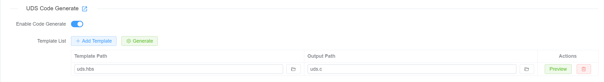

# UDS -> C 代码
<!-- markdownlint-disable MD033 -->

用户可以基于其已配置的 UDS 服务生成 C 代码。代码格式由用户定义的模板决定。


## UDS 代码生成

首先，需要在 UDS Tester 中启用 UDS 代码生成功能。



然后可以添加模板配置（Template Configurations）。每个模板包含两项：

* **Template Path**：从本地文件系统选择模板文件
* **Generate Path**：指定生成代码的保存路径

支持多个模板配置。可按需添加或移除，每个模板均支持运行时预览。

## 特殊属性（Special Properties）

启用 UDS 代码生成功能后，每个服务都支持为`code generation`添加用户自定义的特殊属性。


属性以 Key-Value 形式定义。

**要求：**

* Key 不可重复
* Value 必须为字符串

## 模板（Template）

UDS 代码生成系统基于 [**Handlebars.js**](https://handlebarsjs.com) 模板引擎，并增强了大量自定义 helper 方法，以提供强大的代码生成功能。

### 模板系统概览

<span v-pre>
模板采用 Handlebars 语法，表达式使用 `{{ }}`，块级 helper 使用 `{{# }}{{/ }}`。系统可访问 UDS 服务数据、配置属性以及丰富的 helper 函数。
</span>

### 可用数据上下文

生成代码时，模板可访问：

* **tester:[TesterInfo](https://app.whyengineer.com/scriptApi/interfaces/TesterInfo.html)**：所有已配置的 UDS 服务及其属性
* **project:ProjectInfo**：项目信息，类型如下：

```ts
export interface ProjectInfo {
  name: string
  path: string
}
```

### 自定义 Helper 方法

#### **数学运算**

<span v-pre>
* `{{add a b}}` - 加法
* `{{subtract a b}}` - 减法
* `{{multiply a b}}` - 乘法
* `{{divide a b}}` - 除法
* `{{abs num}}` - 绝对值
* `{{ceil num}}` - 向上取整
* `{{floor num}}` - 向下取整
* `{{modulo a b}}` - 取余
* `{{avg array}}` - 平均值
* `{{sum array}}` - 求和
</span>

#### **字符串处理**

<span v-pre>
* `{{camelcase str}}` - 转为 camelCase
* `{{capitalize str}}` - 首字母大写
* `{{uppercase str}}` - 转为大写
* `{{lowercase str}}` - 转为小写
* `{{dashcase str}}` - 转为 dash-case
* `{{snakecase str}}` - 转为 snake_case
* `{{dotcase str}}` - 转为 dot.case
* `{{append str suffix}}` - 追加后缀
* `{{prepend str prefix}}` - 前置前缀
* `{{trim str}}` - 移除空白
* `{{replace str old new}}` - 文本替换
</span>

#### **数组操作**

<span v-pre>
* `{{first array n}}` - 取前 n 项
* `{{last array n}}` - 取后 n 项
* `{{after array n}}` - 取索引 n 之后的项目
* `{{before array n}}` - 取索引 n 之前的项目
* `{{join array separator}}` - 连接数组元素
* `{{arrayify value}}` - 转为数组
* `{{#forEach array}}...{{/forEach}}` - 遍历数组
* `{{#eachIndex array}}...{{/eachIndex}}` - 带索引遍历
</span>

#### **比较与逻辑**

<span v-pre>
* `{{eq a b}}` - 等于
* `{{ne a b}}` - 不等于
* `{{gt a b}}` - 大于
* `{{lt a b}}` - 小于
* `{{gte a b}}` - 大于等于
* `{{lte a b}}` - 小于等于
* `{{isString val}}` - 是否字符串
* `{{isNumber val}}` - 是否数字
* `{{isArray val}}` - 是否数组
* `{{isDefined val}}` - 是否已定义
* `{{isUndefined val}}` - 是否未定义
</span>

#### **实用函数**

<span v-pre>
* `{{setVar name value}}` - 设置变量
* `{{jsonParse str}}` - 解析 JSON 字符串
* `{{jsonStringify obj}}` - 转为 JSON
* `{{times n}}...{{/times}}` - 重复 n 次
* `{{range start end}}...{{/range}}` - 从 start 到 end 循环
* `{{logFile message}}` - 调试输出
* `{{error message}}` - 抛出错误
</span>

### 模板示例

```handlebars
/* Generated UDS Code */
#include <stdint.h>

{{#forEach services}}
// Service: {{name}}
{{#if (isDefined description)}}
/* {{description}} */
{{/if}}

#define {{uppercase (snakecase name)}}_ID 0x{{serviceId}}

{{#if specialProperties}}
/* Special Properties */
{{#each specialProperties}}
#define {{uppercase (snakecase @key)}} "{{this}}"
{{/each}}
{{/if}}

{{/forEach}}
```

### 更复杂的示例

参见示例 [uds_generate_code](https://app.whyengineer.com/examples/uds_generate_code/readme)。

<!-- markdownlint-enable MD033 -->