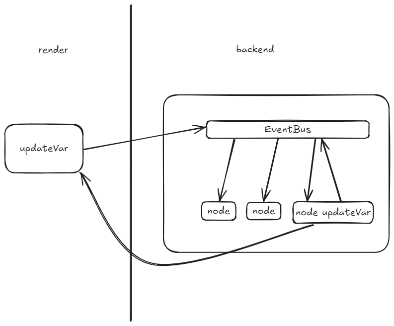
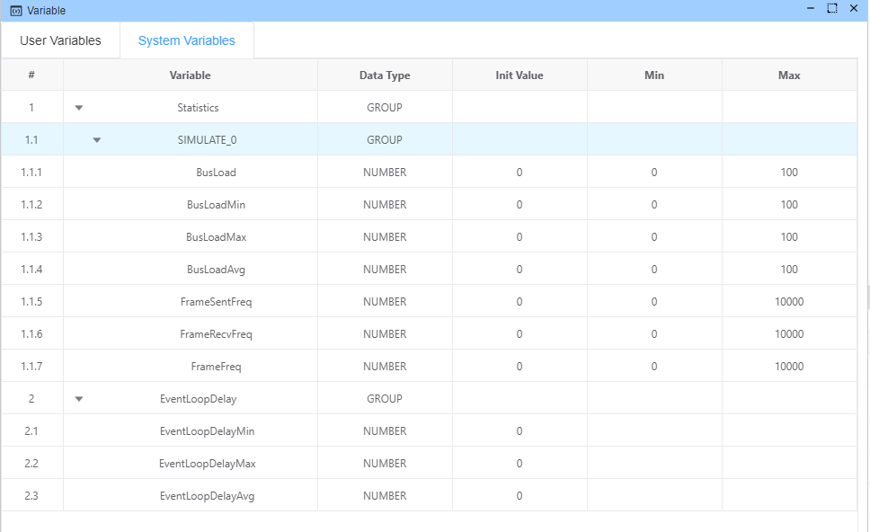
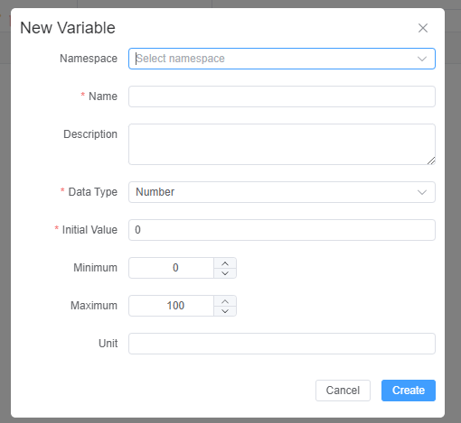
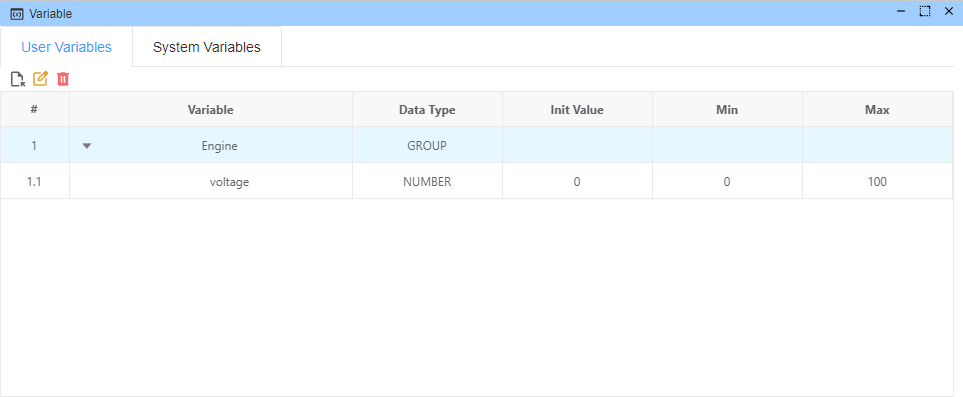
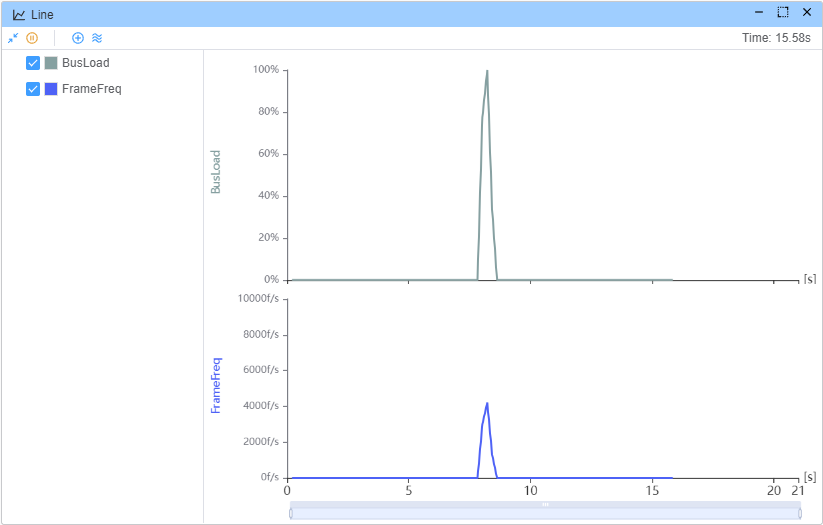

# 变量系统

## 概述

变量系统是一个强大的功能，允许用户在 Ecubus Pro 平台中创建、管理和使用动态值。变量就像虚拟信号在内部系统中流动，它们在不同组件和节点之间传递信息。这些虚拟信号可以被捕获、转换和路由，从而创建了一个灵活且互连的系统，使得一个区域的变化可以自动传播到其他区域。


## 功能特性

* 在[脚本](./../script/script.md)或[详细 API](https://app.whyengineer.com/scriptApi/classes/UtilClass.html#onVar)中设置/获取变量
* 在[图表](./../graph/graph.md)中显示变量
* 默认系统变量

## 系统变量

系统变量是预定义的变量，提供有关系统性能和连接设备的实时信息。这些变量由系统自动更新，用户可以访问但无法直接修改。

### 性能监控变量

系统提供性能监控变量，有助于跟踪应用程序的事件循环性能：

| 变量 ID | 描述 | 单位 |
|-------------|-------------|------|
| `EventLoopDelay.min` | 最小事件循环延迟 - 较低的值表示更好的性能 | ms |
| `EventLoopDelay.max` | 最大事件循环延迟 - 较高的值表示可能存在性能问题 | ms |
| `EventLoopDelay.avg` | 平均事件循环延迟 - 性能和稳定性之间的良好平衡 | ms |

这些变量对于监控应用程序的响应能力和性能至关重要。高事件循环延迟值可能表示处理瓶颈，可能影响系统响应能力。

### 设备统计变量

对于每个连接的 CAN 设备，系统会自动创建一组统计变量：

| 变量 ID 模式 | 描述 | 单位 |
|---------------------|-------------|------|
| `Statistics.{deviceName}.BusLoad` | 指定设备的当前总线负载 | % |
| `Statistics.{deviceName}.BusLoadMin` | 记录的最小总线负载 | % |
| `Statistics.{deviceName}.BusLoadMax` | 记录的最大总线负载 | % |
| `Statistics.{deviceName}.BusLoadAvg` | 平均总线负载 | % |
| `Statistics.{deviceName}.FrameSentFreq` | 发送帧的频率 | f/s |
| `Statistics.{deviceName}.FrameRecvFreq` | 接收帧的频率 | f/s |
| `Statistics.{deviceName}.FrameFreq` | 总体帧频率 | f/s |



## 用户变量

用户变量是根据您的特定需求创建、修改和删除的自定义变量。这些变量可在整个应用程序中用于存储值、跟踪状态和创建动态工作流。

### 支持的数据类型

用户变量支持以下数据类型：

* **Number（数字）**: 数值，可选择最小/最大边界和单位规格
* **String（字符串）**: 用于存储名称、消息或任何字母数字内容的文本值
* **Array（数组）**: 以列表格式组织的值集合

### 创建用户变量

要创建新的用户变量：

1. 导航到变量管理器中的**用户变量**标签页
2. 点击"添加变量"按钮（文件图标）
3. 填写变量详细信息：

   * **命名空间**: （可选）逻辑上对变量进行分组
   * **名称**: 变量的唯一标识符（仅限字母、数字和下划线）
   * **描述**: （可选）关于变量用途的补充说明
   * **数据类型**: 选择数字、字符串或数组
   * **初始值**: 变量的起始值
   * 对于数字类型：
   * **最小值**: 可选的下限
   * **最大值**: 可选的上限
   * **单位**: 可选的测量单位（例如，"ms"、"°C"、"rpm"）




## 示例

使用 Graph-Line 记录 `BusLoad` 和 `FrameFreq`

```typescript
Util.OnKey('b', async () => {
  const pl = []
  const start = Date.now()
  for (let i = 0; i < 5000; i++) {
    const msg: CanMessage = {
      dir: 'OUT',
      data: Buffer.alloc(8).fill(i % 255),
      id: 1,
      msgType: {
        idType: CAN_ID_TYPE.STANDARD,
        brs: false,
        canfd: false,
        remote: false
      }
    }
    pl.push(output(msg))
  }
  await Promise.any(pl)
  const end = Date.now()
  console.log(`send ${pl.length} messages cost ${end - start}ms`)
})
```


