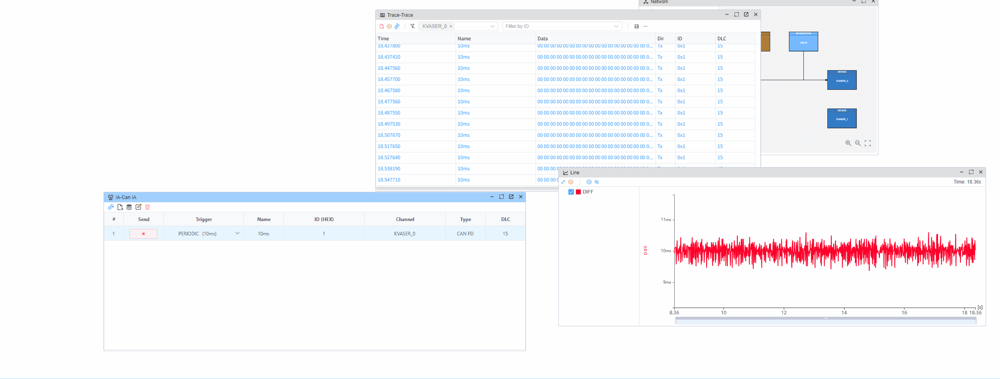

# CAN 高精度定时器示例

> [!NOTE]
> 此示例需要具备硬件时间戳功能的 CAN 设备来测量接收到的 CAN 报文之间的时间间隔。
> 此演示使用 **KVASER** USB-to-CAN 设备。
> 此演示使用 **KVASER** USB-to-CAN 设备。

## 概述

此示例演示如何使用硬件时间戳测量连续 CAN 报文之间的时间间隔。 硬件时间戳提供微秒级精度，允许精确测量报文间隔。 硬件时间戳提供微秒级精度，允许精确测量报文间隔。

## 代码示例

```typescript
import { setVar } from 'ECB'

let t1: number | undefined
Util.OnCan(1, (msg) => {
  const t = msg.ts
  if (!t1) {
    t1 = t
  } else {
    const diff = (t - t1) / 1000
    setVar('DIFF', diff)
    t1 = t
  }
})
```

## 工作原理

1. 代码使用 `Util.OnCan` 监听通道 1 上的 CAN 报文
2. 对于每个接收到的报文，它提取硬件时间戳（`msg.ts`），单位为微秒
3. 它计算连续报文之间的时间差
4. 时间差被转换为毫秒并存储在 `DIFF` 变量中

## 结果



通过硬件时间戳，您可以以微秒级精度精确测量接收到的 CAN 报文之间的时间间隔。
