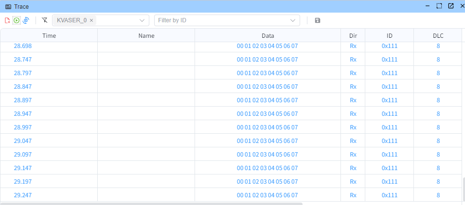

# CAN 高精度定时器示例

> [!NOTE]
> 本示例要求 CAN 盒子具备硬件时间戳功能，以便更好地展示高精度定时器的准确性。
> 此演示使用的是 **KVASER** USB 转 CAN 设备。

## 概述

Node.js 原生的 `setTimeout` 和 `setInterval` 函数的精度为毫秒级别，且精度不够理想。本示例采用 [PrecisionTimer](https://app.whyengineer.com/scriptApi/classes/PrecisionTimer.html) 来实现微秒级高精度定时器。

## 代码示例


```typescript
import { CAN_ID_TYPE, CanMessage, output, PrecisionTimer } from 'ECB'

// 创建高精度定时器实例
const timer = new PrecisionTimer('can_timer')
timer.create()

Util.Init(() => {
    // 添加定时任务：每 50 毫秒（50000 微秒）发送一次 CAN 消息
    timer.addTask(50000, 50000, () => {
        const canMsg: CanMessage = {
            id: 0x111,
            data: Buffer.from([0, 1, 2, 3, 4, 5, 6, 7]),
            dir: 'OUT',
            msgType: {
                idType: CAN_ID_TYPE.STANDARD,
                remote: false,
                brs: false,
                canfd: false
            }
        }
        output(canMsg)
    })
})

Util.End(() => {
    // 清理定时器资源
    timer.destroy()
})
```

## 运行效果



通过硬件时间戳可以看到，消息发送间隔非常精确，误差在微秒级别。
