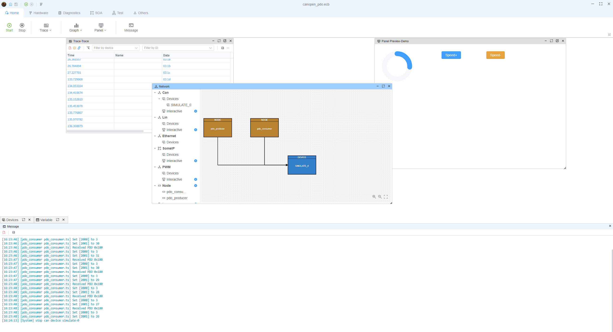
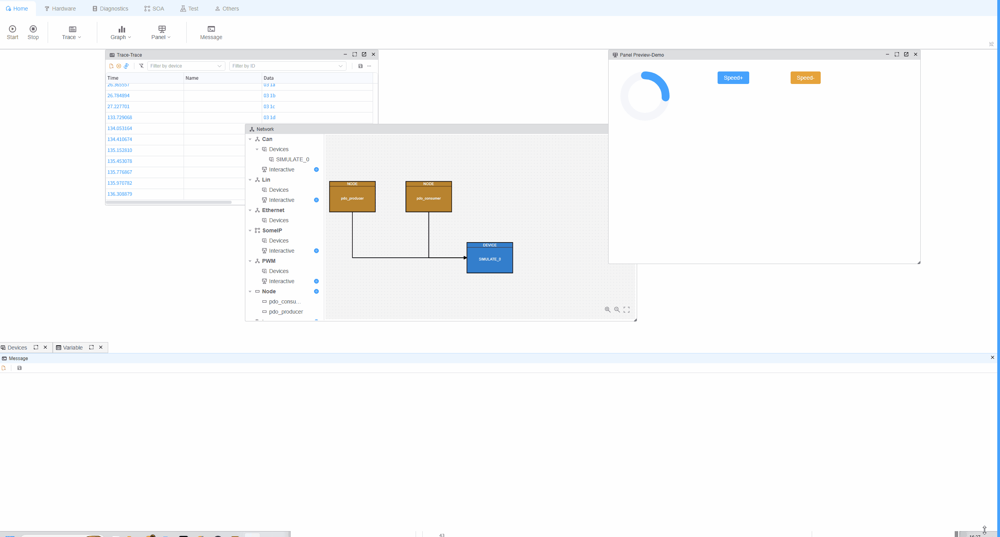

# CANopen PDO Example

## Overview

This example shows **Process Data Objects (PDOs)** on a single CAN channel: one script **transmits** a TPDO when an object dictionary value changes, and the other **receives** that frame as an RPDO and prints the decoded mapping.

PDO traffic is low-overhead compared to SDO—suited for periodic or event-driven process data. Here both nodes attach to the same simulated CAN device (`SIMULATE_0`, 500 kbit/s) defined in `canopen_pdo.ecb`.

---

## Project layout

| File | Role |
|------|------|
| `canopen_pdo.ecb` | ECUBUS project with two script nodes on one CAN device |
| `pdo_producer.ts` | CANopen device (node ID `0xB`) with a TPDO on COB-ID `0x180`, mapping `0x2000` (counter) + `0x2001` (motor speed, `0-100`) |
| `pdo_consumer.ts` | Same node ID in a **separate** script instance with an RPDO on `0x180`, mapping into `0x2000` + `0x2001` |

Each script wires the stack to the bus with `Util.OnCan` → `device.receive(...)` and forwards stack TX with `device.addListener('message', ...)` → `output(...)`.

## Producer (`pdo_producer.ts`)

1. Adds object `0x2000` (8-bit unsigned test value) and `0x2001` (motor speed, `0-100`).
2. Declares a **transmit PDO** with `transmissionType: 254` (send when mapped value changes), COB-ID `0x180`, payload from `0x2000` + `0x2001`.
3. Calls `device.start()` and `device.nmt.startNode()` so the device is operational.
4. Every 100 ms increments `0x2000` three times (`1 -> 2 -> 3`), which triggers TPDO sends.
5. Speed (`0x2001`) is controlled by panel variables:
   - `MotorSpeedPlus`: increment speed by 1 (clamped to `100`)
   - `MotorSpeedMinus`: decrement speed by 1 (clamped to `0`)
   Each change updates `0x2001` and triggers TPDO send-on-change.

## Consumer (`pdo_consumer.ts`)

1. Adds `0x2000` and `0x2001` and a **receive PDO** on COB-ID `0x180` mapped to both objects.
2. After `start()` / `startNode()`, listens with `device.pdo.on('pdo', ...)` and logs COB-ID and each mapped object’s value.
3. When object `0x2001` is received, it writes the value to global variable `MotorSpeed` via `setVar("MotorSpeed", value)`.

## How to run

1. Open `canopen_pdo.ecb` in ECUBUS Pro.
2. Ensure both scripts (`pdo_producer`, `pdo_consumer`) use the same CAN channel (as in the bundled project).
3. Run the project; watch the consumer output for `Received PDO` lines with two mapped values (counter and speed).
4. Toggle `MotorSpeedPlus` / `MotorSpeedMinus` in the panel to change speed and observe synchronized PDO updates on the consumer side.

## Further examples

The underlying stack follows common CANopen PDO patterns. For more standalone scenarios (NMT, SDO, SYNC, TIME, LSS, EMCY, etc.), see the **node-canopen** examples:

[https://github.com/Daxbot/node-canopen/tree/main/examples](https://github.com/Daxbot/node-canopen/tree/main/examples)
