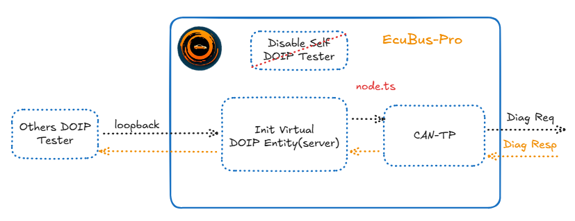
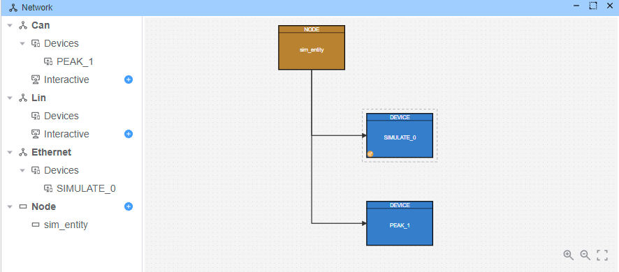

# DoIP Gateway

This example demonstrates how to implement a DoIP to CAN gateway that bridges communication between DoIP testers and CAN-based ECUs. The gateway receives DoIP diagnostic requests and forwards them to CAN bus, then returns the CAN responses back via DoIP.

## Architecture Overview

The example simulates a DoIP gateway that:
1. Registers as a DoIP virtual entity - see the [example](./../doip_sim_entity/readme.md) for details on virtual entity registration
2. Receives DoIP diagnostic requests from Ethernet testers
3. Forwards requests to CAN bus via CANTP
4. Returns CAN responses back to the DoIP tester



## Setup

### Device Configuration

Configure the network topology with:
- **Lin**: Ethernet connection for DoIP communication
- **Can**: CAN bus connection for ECU communication
- **Devices**: 
  - `SIMULATE_0`: Simulates the DoIP interface
  - `PEAK_1`: CAN interface for ECU communication

### Node Configuration

Add a node item and attach the gateway script (`node.ts`)



The gateway script implements the following functionality:

```typescript
import { DiagResponse, output, RegisterEthVirtualEntity } from 'ECB'

Util.Init(async () => {
  console.log('Registering virtual entity')
  await RegisterEthVirtualEntity(
    {
      vin: '123456789',
      eid: '00-00-00-00-00-00',
      gid: '00-00-00-00-00-00',
      logicalAddr: 100
    },
    '127.0.0.1'
  )
})

Util.On("Tester_eth_1.*.send", async (req) => {
  console.log('Received DOIP Diag request')
  req.testerName='Tester_can_0'
  await req.outputDiag('PEAK_1')
})
Util.On("Tester_can_0.*.recv", async (resp) => {
  console.log('Received CANTP Diag response')
  resp.testerName='Tester_eth_1'
  await resp.outputDiag('SIMULATE_0')
})
```

**Key Features:**
- **DoIP Entity Registration**: Registers a virtual entity with logical address 100
- **Request Forwarding**: Converts DoIP requests to CAN diagnostic requests
- **Response Bridging**: Forwards CAN responses back to DoIP tester


## Using Python Client As Other Tester

A Python test client (`client.py`) is provided for external testing:

```python
import udsoncan
from doipclient import DoIPClient
from doipclient.connectors import DoIPClientUDSConnector
from udsoncan.client import Client
from udsoncan.services import *

udsoncan.setup_logging()

ecu_ip = '127.0.0.1'
ecu_logical_address = 100
doip_client = DoIPClient(ecu_ip, ecu_logical_address, client_logical_address=200)
conn = DoIPClientUDSConnector(doip_client)

with Client(conn, request_timeout=2) as client:
    try:
        client.change_session(DiagnosticSessionControl.Session.extendedDiagnosticSession)
    except NegativeResponseException as e:
        print('Server refused request:', e.response.code_name)
    except (InvalidResponseException, UnexpectedResponseException) as e:
        print('Invalid server response:', e.response.original_payload)

doip_client.close()
```

**Prerequisites for Python client:**
```bash
pip install udsoncan doipclient
```

## Execution

1. **Start the simulation**: Start Run in EcuBus-Pro
2. **Monitor traffic**: Use the built-in trace window to view all frames
3. **Alternative monitoring**: Use Wireshark to capture network traffic
4. **Test with Python**: Run `python client.py` to send test requests

