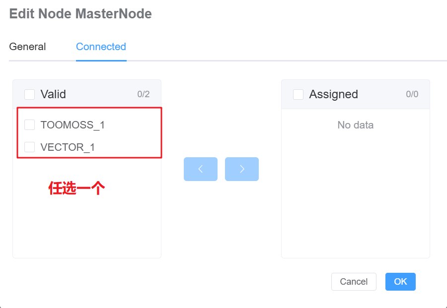

# LIN 自动寻址 (AA) 示例

## 概述

LIN 自动寻址用于为 LIN 从节点分配/变更 NAD。

## 验证设备

Toomoss & Vector

## 图示

## 功能lin_aa_demolin_aa_demo

- LIN设备自动寻址功能

## 文件

- `lin_aa.ecb`: 工程配置
- `lin_aa.ts`: TypeScript 实现脚本
- `README.md` / `README.zh.md`: 文档

## 使用步骤

1. 用 EcuBus Pro 打开 `lin_aa.ecb`
2. 配置 LIN 硬件
   1. 
3. 启动前设置变量：
   - `LIN_AA.SupplierID`：十六进制字符串，支持 `7FFF` 或 `0x7FFF`
   - `LIN_AA.NadTable`：以空格分隔的十六进制字节，如 `01 02 03 04 11 aa`
4. 将 `LIN_AA.StartAA` 置为 `1` 开始，置为 `0` 停止
5. 可在控制台按 `c` 打印当前 `SupplierID` 与 `NadTable`（十六进制）

## 自动寻址时序

1. Assign NAD（初始化）
2. 若干个 Set NAD（按 `NadTable` 顺序逐个设置）
3. Save（保存）
4. Finish（完成）

## 参考

- LIN 2.2 规范
- EcuBus Pro 用户手册

