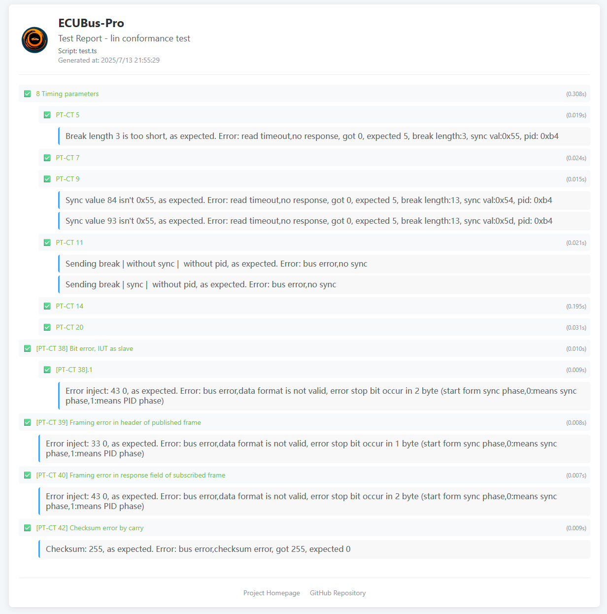

# LIN Conformance Test Example

This example demonstrates comprehensive LIN conformance testing using EcuBus-Pro and LinCable, following the ISO/DIS 17987-6 standard. The test suite validates LIN protocol compliance, timing parameters, and error handling capabilities through advanced fault injection techniques.

## Overview

The LIN conformance test example provides a complete testing framework for validating LIN network components according to automotive industry standards. It utilizes LinCable's advanced fault injection capabilities to simulate various error conditions and verify proper error handling in LIN slave nodes.

## Used Devices

- **[EcuBus-LinCable](https://app.whyengineer.com/docs/um/hardware/lincable.html)**: USB to LIN adapter with advanced fault injection capabilities (required for error injection testing)

> [!NOTE]
> Fault injection testing requires EcuBus-LinCable as it is the only device capable of performing error injection operations. Standard LIN adapters cannot perform these advanced testing functions.

## Test Frame Definitions

The example includes several predefined test frames for different testing scenarios:

> [!NOTE]
> Test frames can be customized to match your specific LIN network configuration. Support for importing frames from LDF files will be available in an upcoming release.

### Master Transmit Frames
- **TST_FRAME_2**: ReadByIdentifier command frame (ID: 0x3C)
- **TST_FRAME_4_Rx**: Device-specific receive frame (ID: 0x33)
- **TST_FRAME_14**: Master transmit frame with checksum testing

### Slave Response Frames
- **TST_FRAME_4_Tx**: Device-specific transmit frame (ID: 0x34)
- **TST_FRAME_6**: Slave response command frame (ID: 0x3D)
- **TST_FRAME_7**: Additional slave response frame (ID: 0x34)

## Test Script

Test script is in the [test.ts](https://github.com/ecubus-pro/ecubus-pro/blob/main/resources/examples/lin_conformance_test/test.ts) file.

## Test Report

Exported test report:

