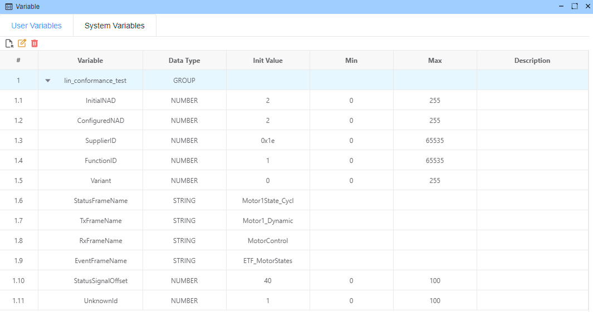
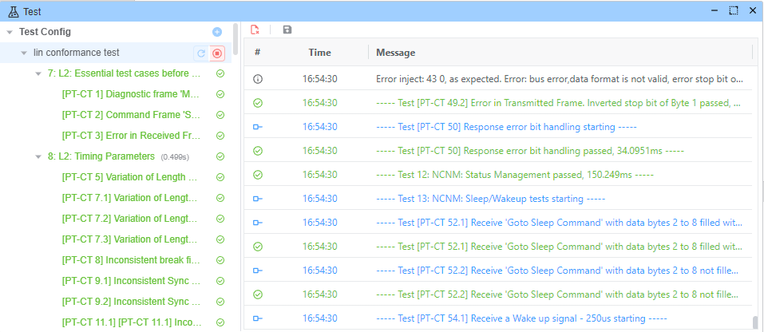
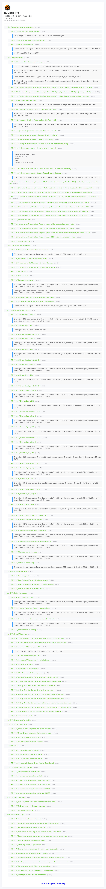

# LIN 一致性测试示例

本示例演示了使用 EcuBus-Pro 和 LinCable 遵循 ISO/DIS 17987-6 标准进行的全面 LIN 一致性测试。 该测试套件通过先进的故障注入技术验证 LIN 协议合规性、时序参数和错误处理能力。

## 概述

LIN 一致性测试示例提供了一个完整的测试框架，用于根据汽车行业标准验证 LIN 网络组件。 它利用 LinCable 的先进故障注入能力来模拟各种错误条件，并验证 LIN 从节点中的正确错误处理。

您可以修改测试脚本来实现自己的额外测试要求。

## 使用的设备

- **[EcuBus-LinCable](https://app.whyengineer.com/docs/um/hardware/lincable.html)**：具有先进故障注入能力的 USB 转 LIN 适配器（错误注入测试必需）

> [!NOTE]
> 故障注入测试需要 EcuBus-LinCable，因为它是唯一能够执行错误注入操作的设备。 标准 LIN 适配器无法执行这些高级测试功能。

## 测试数据库

一致性测试依赖于 LIN 描述文件 (LDF)。 LDF 定义了 LIN 网络拓扑、节点信息、信号定义等。

测试数据库位于 [LINdb.ldf](https://github.com/ecubus-pro/ecubus-pro/blob/main/resources/examples/lin_conformance_test/LINdb.ldf) 文件中。

## 用户变量

虽然我们已有数据库，但我们也定义了额外的用户变量以方便自动化测试。

| 变量                 | 类型     | 默认值                                     | 范围      | 描述                                       |
| ------------------ | ------ | --------------------------------------- | ------- | ---------------------------------------- |
| InitialNAD         | number | 2                                       | 0–255   | 配置前的初始节点地址；用于诊断寻址和预配置通信。                 |
| ConfiguredNAD      | number | 2                                       | 0–255   | 配置后的节点地址；用于验证配置和后续通信使用预期地址。              |
| SupplierID         | number | 0x1e                                    | 0–65535 | 供应商标识符，用于标识/一致性检查，例如标识符读取。               |
| FunctionID         | number | 1                                       | 0–65535 | 用于与节点标识/功能一致性相关测试的功能标识符。                 |
| Variant            | number | 0                                       | 0–255   | 变体编号，用于在测试场景中区分固件/配置变体。                  |
| StatusFrameName    | string | "Motor1State_Cycl" | -       | 用于周期性读取从节点状态的状态帧名称，与 LDF 对应。             |
| TxFrameName        | string | "Motor1_Dynamic"   | -       | 主节点发送帧名称，用于向从节点发送动态数据/命令。                |
| RxFrameName        | string | "MotorControl"                          | -       | 用于主节点控制和回读协调的帧名称。                        |
| EventFrameName     | string | "ETF_MotorStates"  | -       | 事件触发帧名称，用于与事件和冲突解决相关的测试。                 |
| StatusSignalOffset | number | 40                                      | 0–100   | 状态字段在状态帧内的位偏移（例如，用于定位 `response_error`）。 |
| UnknownId          | number | 1                                       | 0–100   | 无效/未知 ID 测试参数，用于验证异常帧 ID 的错误处理。          |

## 测试脚本

测试脚本位于 [test.ts](https://github.com/ecubus-pro/ecubus-pro/blob/main/resources/examples/lin_conformance_test/test.ts) 文件中。

## 测试报告

导出的测试报告：

