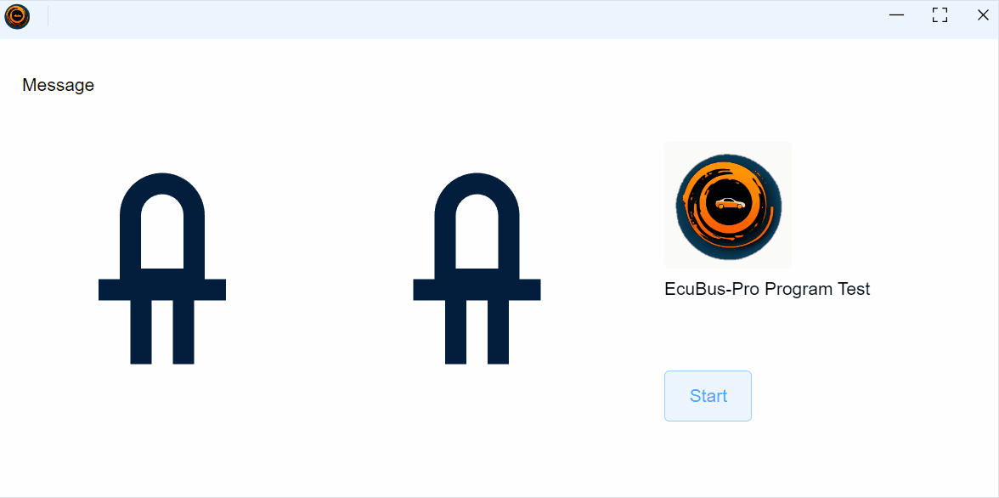

# Led Control Panel Example

This example demonstrates a simple program execution panel in EcuBus-Pro, including status indication and message display.


## Features Demonstrated

1. **Program Execution Control**
   - A "Start" button toggles the execution of a simulated program.
   - When started, the program runs for a random time (2-5 seconds) and then fails automatically.

2. **Status Indication**
   - Two large LED indicators:
     - **Red LED**: Lights up when the program fails.
     - **Blue LED**: Lights up when the program succeeds (not used in this demo, but present for extension).
   - Status message area displays the current state (e.g., "Starting program execution", "Program failed after random time", "Manual stop of program execution").

3. **Panel Layout**
   - Includes a logo and title for easy identification.
   - All controls and indicators are arranged in a grid for clarity.

## Variables Used

| Variable Name      | Type    | Purpose / Description                                 |
|--------------------|---------|------------------------------------------------------|
| Program.run        | number  | Controls the start/stop of the program (triggered by the Start button). |
| Program.success    | number  | Indicates if the program succeeded (set to 1 on start, 0 on failure/stop). |
| Program.failed     | number  | Indicates if the program failed (set to 1 on failure, 0 otherwise). |
| Program.msg        | string  | Displays the current status message in the panel.     |

> More information about variables can be found in the [Variable](../../../docs/um/var/var.md) section.

## How It Works

- Press the **Start** button to begin the program.
- The message area will show "Starting program execution".
- After a random interval (2-5 seconds), the program will simulate a failure:
  - The message updates to "Program failed after random time".
  - The red LED lights up.
  - The Start button resets.
- You can manually stop the program by toggling the Start button off, which will show "Manual stop of program execution".

## Example Panel



## Code Overview

- **panel.ecb**: Defines the panel layout, variables, and UI elements.
- **program.ts**: Handles the logic for starting, stopping, and simulating program failure.

```typescript
import { setVar } from 'ECB'
let timer: NodeJS.Timeout
Util.OnVar('Program.run', async (args) => {
  if (args.value == 1) {
    setVar('Program.success', 1)
    setVar('Program.failed', 0)
    setVar('Program.msg', 'Starting program execution')
    timer = setTimeout(async () => {
      setVar('Program.msg', 'Program failed after random time')
      setVar('Program.failed', 1)
      setVar('Program.success', 0)
      setVar('Program.run', 0)
    }, randomTime)
  } else {
    setVar('Program.msg', 'Manual stop of program execution')
    setVar('Program.success', 0)
    setVar('Program.failed', 0)
    clearTimeout(timer)
  }
})
const randomTime = Math.floor(Math.random() * (5000 - 2000 + 1)) + 2000
```
