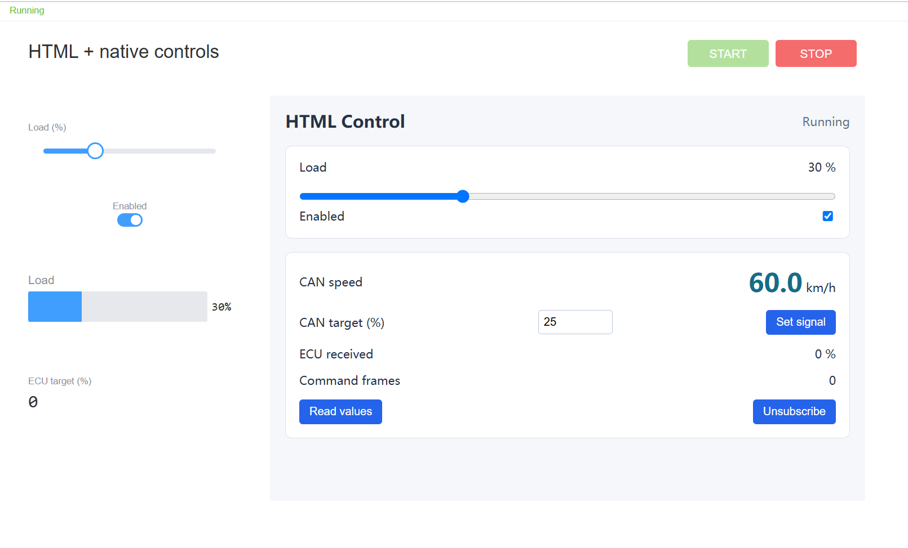

# HTML Control Example

Open `HtmlControl.ecb`. It uses its own two simulate CAN channels, so no hardware is required. An EcuBus-Pro build with the new Panel is needed.



## Run

1. Click **START** on the panel. The first run compiles `ecu.ts`.
2. Drag Load inside the HTML control: the native slider on the left and the progress bar follow, and CAN speed shows twice the load.
3. Toggle the native Enabled switch on the left: the HTML checkbox follows, and the speed drops to 0 when disabled.
4. In the **HTML Command** interactive window, start periodic sending of `0x101 Command`. If the window is hidden, open it from the interactive node menu.
5. Enter `45` in the HTML CAN target and click **Set signal**. ECU received shows `45 %`, Command frames keep increasing, and the speed becomes `90.0 km/h`.
6. Click **Unsubscribe**: the HTML stops updating automatically; **Read values** reads once; **Subscribe** restores the subscription.
7. Click **STOP**: write controls are disabled. Calling the write API directly also returns `Panel is stopped`.

Before periodic sending starts, Load is controlled by the slider. Once it starts, the ECU takes the Target from every Command it receives, overriding the manual Load. Stop periodic Command sending before testing the slider again.

| Channel                                      | Node                              | Role                                     |
| -------------------------------------------- | --------------------------------- | ---------------------------------------- |
| HTML_ECU / simulate 0   | HTML ECU / ecu.ts | Sends 0x100 every 100 ms, receives 0x101 |
| HTML_PANEL / simulate 1 | HTML Command                      | Sends 0x101 every 100 ms, receives 0x100 |

`panel.setSignal` updates the signal cache and does not send a frame by itself. Success does not mean the ECU received it; check ECU received and Command frames to confirm bus traffic.

## Files

| File                            | Content                                                         |
| ------------------------------- | --------------------------------------------------------------- |
| HtmlControl.ecb | Variables, database, simulate channels and panel reference      |
| html.ecpanel    | Standalone panel with embedded HTML/CSS and JavaScript          |
| control.html    | Editable HTML/CSS source                                        |
| control.js      | Editable bridge API example                                     |
| ecu.ts          | Simulated ECU script                                            |
| HtmlDemo.dbc    | Status.Speed and Command.Target |
| sync-panel.mjs  | Copies both source files into html.ecpanel      |

After editing `control.html` or `control.js`, run from the repository root:

```powershell
node resources/examples/panel_html/sync-panel.mjs
```

Then close and reopen the example project so the app reads the `.ecpanel` again. Close any window editing this panel before syncing so it does not save older content over the file later. At runtime only the content inside `.ecpanel` is used; the `.html` / `.js` source files are not loaded.

## API

```javascript
const value = await panel.getVar('HtmlLevel')
await panel.setVar('HtmlLevel', 50)
const off = await panel.onVar('HtmlLevel', value => console.log(value))
off()

const signal = await panel.getSignal('HtmlDemo.Speed')
console.log(signal.rawValue, signal.physicalValue)
await panel.setSignal('HtmlDemo.Target', '45') // physical 45%, DBC raw value 450
await panel.setSignal('HtmlDemo.Target', 450)  // a number is the raw value
const offSignal = await panel.onSignal('HtmlDemo.Speed', signal => console.log(signal.physicalValue))
offSignal()
```

Variable callbacks receive the value itself; signal callbacks receive an object with `rawValue` and `physicalValue`. Variable names use the full path; signal names are `database.signal`, and ambiguous signal names in the same database are rejected. `getSignal()` returns the latest decoded transmitted or received frame sample in the current measurement, independent of HTML subscriptions; without a sample it falls back to the project database value, which may be unset. `setSignal()` updates the transmit database; success does not confirm transmission or ECU processing, so reading immediately after writing is not guaranteed to return the new value. Signal recording starts with measurement so a first read or a newly opened window can retrieve earlier one-shot samples.

`HtmlLevel` and `HtmlEnabled` are bound to native controls with Remember value on, so their values are written back to the project when measurement stops; `HtmlRxTarget` and `HtmlRxCount` are runtime state and are not written back. The HTML runs in a sandboxed iframe through `window.panel` and cannot use Node, Electron IPC, `require` or `import ... from 'ECB'` directly. `ECB` is only for node scripts such as `ecu.ts`.

See the [Panel documentation](../../../docs/um/panel/index.md) for usage.
