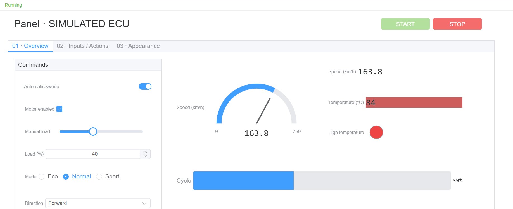

# Panel Showcase

A ready-to-open Panel demo project that uses two `simulate` CAN channels, so no hardware is required.

| Channel | Node | Messages |
|---|---|---|
| `SIM_ECU` | Demo ECU (`simulation.ts`) | Sends `0x100 Status` (100 ms), receives `0x101 Command` |
| `SIM_PANEL` | Panel Command (interactive node) | Sends `0x101 Command` (100 ms), receives `0x100 Status` |

Open `PanelShowcase.ecb`, click Start, then open the Panel Command window and start periodic `Command` sending. The Panel's DBC target writes `Command.Target`; with Automatic sweep off, Demo ECU sets the load from `Target`. Speed, temperature and other `Status` signals are shown back on the Panel.

The main Panel has three pages:

- Overview: START/STOP, switch, checkbox, slider, numeric input, radio group, select, button, gauge, numeric display, LED, progress bar and DBC physical-value input.
- Inputs / Actions: Hex/Text editor, byte editor, file/directory/save path selection, hexadecimal and binary input, and plain Button actions.
- Appearance: six LED shapes, three Button shapes, four progress directions, an embedded image and an HTML + JavaScript control. Three Buttons toggle `DemoToggle` and six LEDs follow it; the Fill slider, four progress bars and the HTML control share `DemoFill`, so changing one updates the others, and the script lights the Fill ≥ 80 indicator when `DemoFill` ≥ 80. The HTML control also subscribes to the `PanelDemo.Speed` signal.

`simulation.ts` is the simulated ECU: it periodically generates speed, temperature, load, state and counters, and receives Panel variables and CAN commands. `PanelDemo.dbc` is the demo DBC, `variables.json` lists the variables, and the `.ecpanel` files are standalone Panel files.

Project: `PanelShowcase.ecb`  
Main panel: `showcase.ecpanel`  
Detail panel: `detail.ecpanel`  
Simulation script: `simulation.ts`

Copy the whole folder before opening the project and keep the relative paths. Give each project its own folder: projects sharing a folder also share the generated `tsconfig.json` and variable types, which breaks script compilation. `DEMO.md` is the target of the file Button.

Remember value in the Panel control properties is on by default: when measurement stops, the bound user-variable values are written back to the project, and after saving the project the next measurement starts from them. When it is off, every measurement starts from the control's initial value. Values assigned by the startup script still override it; this example initializes its user parameters from the current variable values.
