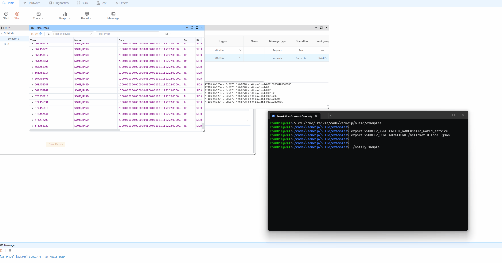

# SOME/IP 远程示例（vsomeip `notify-sample`）

此文件夹中的 `remote` 端基于官方的 `vsomeip` 示例应用：`notify-sample`。
您可以将其视为远程 SOME/IP 服务，而 `ecubus-pro` 则作为发现该服务并接收通知的客户端。

## 1. 先决条件

- `vsomeip` 已安装且正常工作（包括示例二进制文件）
- `notify-sample` 可在远程主机上执行
- 远程主机与本地主机之间具备网络连接
- 此文件夹中的 `someip_remote.json` 已准备就绪（根据需要调整路径）

## 2. 网络准备（Linux）

如果您的环境中默认未启用多播路由，请运行：

```bash
sudo ip route add multicast 224.0.0.0/4 dev eth0
```

将 `eth0` 替换为您实际的网络接口（例如 `enp3s0`、`ens33` 等）。

## 3. 设置 vsomeip 环境变量

在您将启动 `notify-sample` 的同一终端中设置这些变量：

```bash
export VSOMEIP_CONFIGURATION=/path/to/someip_remote.json
export VSOMEIP_APPLICATION_NAME=hello_world_service
```

注意：

- `VSOMEIP_CONFIGURATION`：远程端 vsomeip 配置文件的路径
- `VSOMEIP_APPLICATION_NAME`：必须与配置文件中定义的应用程序名称匹配

## 4. 启动远程端（`notify-sample`）

```bash
notify-sample
```

如果启动成功，您应该会看到与服务注册、服务发现和事件通知相关的日志。

## 5. 与 EcuBus-Pro 配合使用

1. 在 EcuBus-Pro 中打开 `someip_remote` 示例（或导入等效配置）
2. 确保本地/远程 IP、端口、服务 ID、实例 ID 和事件组值匹配
3. 在 `SomeIP IA` 中，首先运行 `subscribe` 操作（`someipOp=subscribe`，`methodId=0x8778`）
4. 订阅成功后，运行或观察通知流（第二个 SOME/IP IA 操作），并验证来自 `notify-sample` 的通知

重要提示：

- 此项目包含 **两个** SOME/IP IA 操作。
- 您必须首先执行 **subscribe** 操作；否则，将无法收到通知消息。



## 6. 故障排除

- 服务未被发现：
  - 验证网络连接（`ping`）
  - 检查 SOME/IP UDP 多播/单播流量的防火墙规则
  - 确认 `someip_remote.json` 与 EcuBus-Pro 设置匹配
- 服务已发现但无事件：
  - 在检查通知之前，验证 `subscribe` 操作是否已成功执行
  - 验证 `notify-sample` 是否仍在运行并发布通知
- 多网卡环境问题：
  - 在配置中绑定正确的网卡/IP
  - 临时仅启用目标网卡以消除路由歧义

## 7. 最小启动命令

```bash
sudo ip route add multicast 224.0.0.0/4 dev eth0
export VSOMEIP_CONFIGURATION=/path/to/someip_remote.json
export VSOMEIP_APPLICATION_NAME=hello_world_service
notify-sample
```