# UDS 认证服务(0x29) 示例

0x29 认证服务在 ISO 14229-1:2020 中引入，作为传统安全访问(0x27)服务的现代替代方案。 0x29 认证服务在 ISO 14229-1:2020 中引入，作为传统安全访问(0x27)服务的现代替代方案。 本指南演示如何使用 EcuBus-Pro 实现和测试 0x29 服务，为 ECU 访问提供更安全、基于证书的认证机制。

> 注意：ISO 15765-4 已弃用 0x27 服务，使 0x29 成为现代汽车安全实施的推荐方法。

## 认证模式

0x29 服务支持两种认证模式：

1. **APCE（非对称拥有证明和证书交换）** - 主要模式
2. **ACR（非对称挑战响应）** - 很少使用

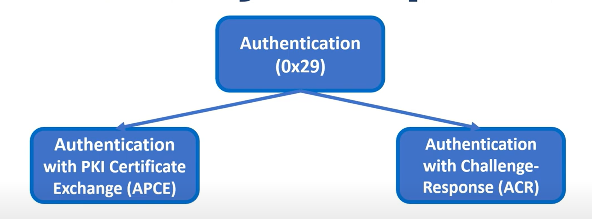

### APCE（证书交换验证）概述

使用 0x27 的传统安全方法存在重大漏洞 - 一旦密钥或算法被泄露，任何实体都可以随时访问 ECU。 0x29 APCE 模式通过要求以下内容来解决这些问题： 0x29 APCE 模式通过要求以下内容来解决这些问题：

1. **唯一证书**：与共享密钥不同，每个供应商都有包含识别信息的唯一证书，如果被泄露可实现问责
2. **证书颁发机构控制**：供应商必须向 OEM 请求证书，移除自签名能力
3. **时间限制访问**：证书具有过期日期，不像永久密钥

### ACR（挑战响应）概述

此模式类似于 0x27，但使用非对称加密和服务器生成的挑战来防止重放攻击。 然而，AUTOSAR DCM 并不广泛推荐使用它。 然而，AUTOSAR DCM 并不广泛推荐使用它。

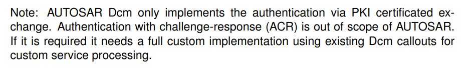

## APCE 实现细节

APCE 认证过程使用几个关键子功能：

- `deAuthenticate` (0x00)
- `verifyCertificateUnidirectional` (0x01)
- `verifyCertificateBidirectional` (0x02)
- `proofOfOwnership` (0x03)
- `authenticationConfiguration` (0x08)

### deAuthenticate（子功能：0x00）

终止认证会话并重置服务器状态。

**请求格式：**
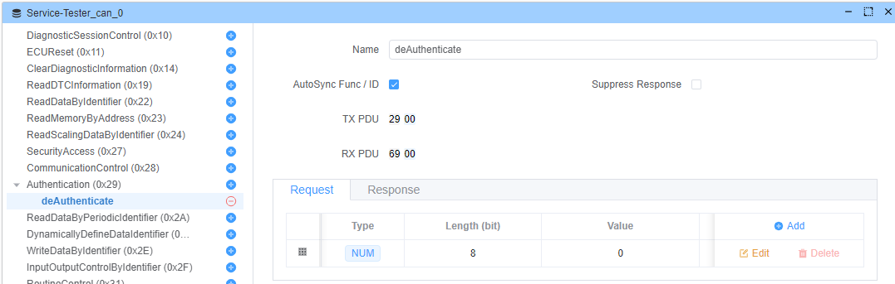

**响应格式：**


### verifyCertificateUnidirectional（子功能：0x01）

启动单向证书验证，服务器验证客户端。

**请求参数：**

1. `communicationConfiguration` (1 字节) - 必须为 0x00
2. `lengthOfCertificateClient` (2 字节) - 证书长度
3. `certificateClient` (可变) - 客户端证书数据
4. `lengthOfChallengeClient` (2 字节) - 挑战长度
5. `challengeClient` (可变) - 加密安全随机挑战

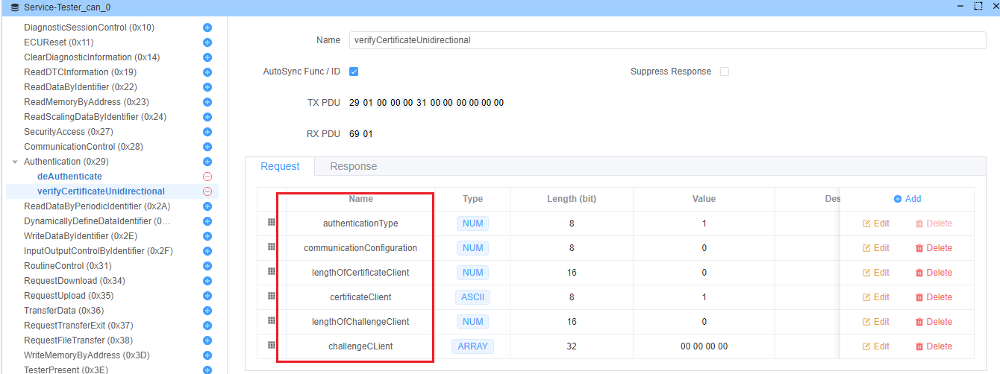

**响应参数：**

1. `returnValue` (1 字节) - 操作结果代码
2. `lengthOfChallengeServer` (2 字节) - 服务器挑战长度
3. `challengeServer` (可变) - 服务器生成的挑战
4. `lengthOfEphemeralPublicKeyServer` (2 字节) - 服务器公钥长度
5. `ephemeralPublicKeyServer` (可变) - 服务器的临时 ECDH/DH 公钥

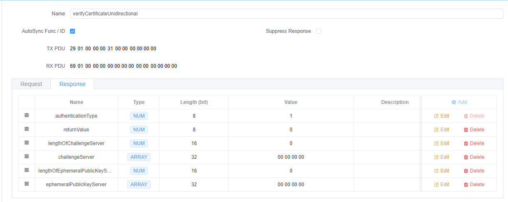

### proofOfOwnership（子功能：0x03）

证明客户端拥有与证书对应的私钥。

**请求参数：**

1. `lengthOfProofOfOwnershipClient` (2 字节)
2. `proofOfOwnershipClient` (可变) - 服务器挑战的数字签名
3. `lengthOfEphemeralPublicKeyClient` (2 字节)
4. `ephemeralPublicKeyClient` (可变) - 客户端的临时公钥

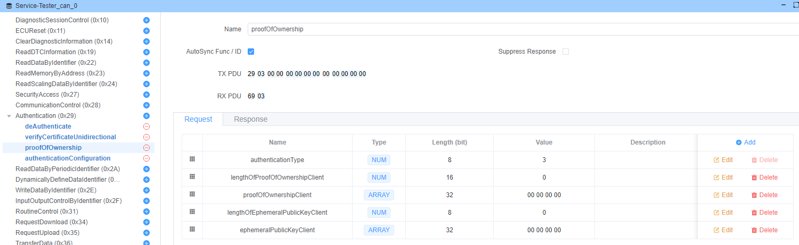

**验证过程：**
服务器使用证书的公钥验证客户端的数字签名：

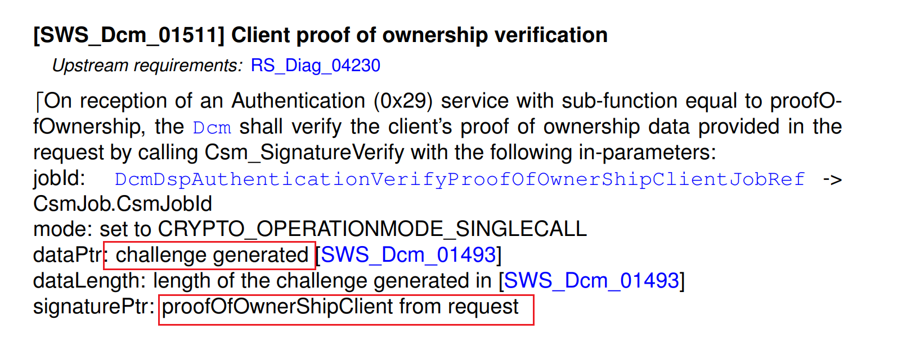

**响应参数：**

1. `returnValue` (1 字节) - 验证结果
2. `lengthOfSessionKeyInfo` (2 字节) - 会话密钥信息长度
3. `sessionKeyInfo` (可变) - 派生的会话密钥数据

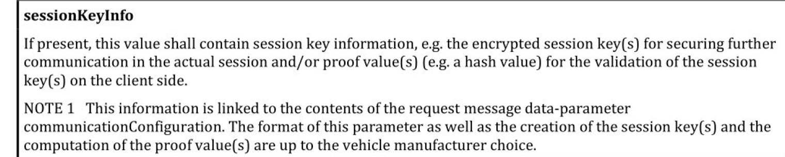

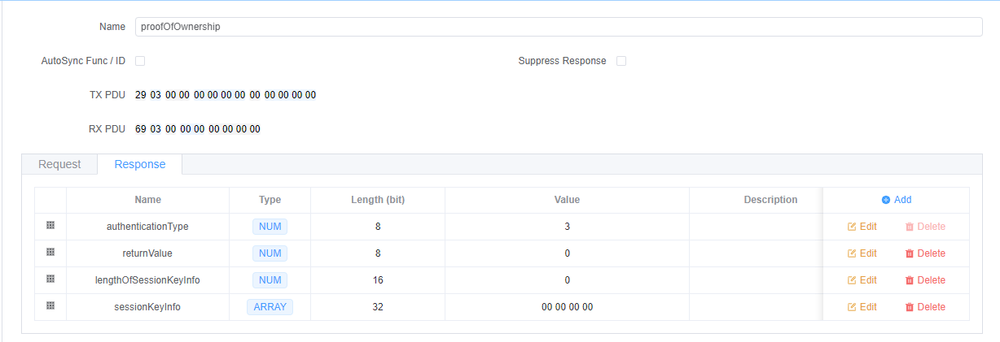

> 注意：AUTOSAR DCM 目前不支持会话密钥：
> 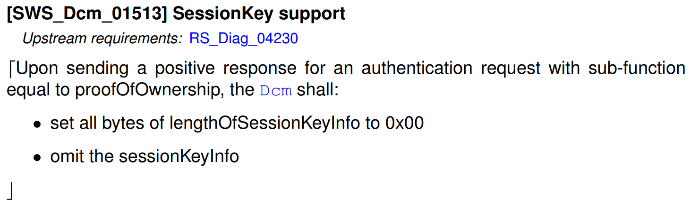

### authenticationConfiguration（子功能：0x08）

启动 APCE 模式配置。

**请求：**
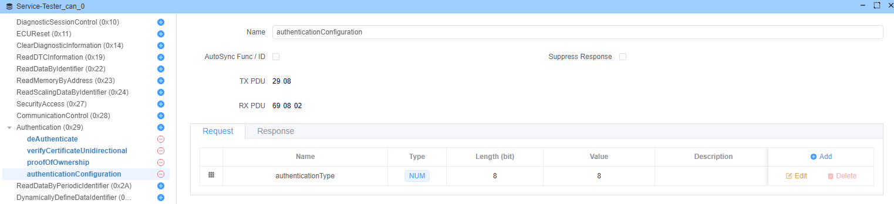

**响应：**
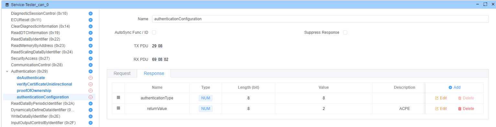

## 证书准备

使用 OpenSSL 生成必要的证书：

### 1. 生成根 CA 私钥

```bash
openssl genrsa -out ca.key 4096
```

### 2. 创建根 CA 证书

创建配置文件 `req.cnf`：

```ini
[ req ]
default_bits = 4096
prompt = no
default_md = sha256
distinguished_name = dn
x509_extensions = v3_ca

[ dn ]
C = CN
ST = ChongQing
L = ChongQing
O = EcuBus-pro
OU = EcuBus-pro Development Team
CN = app.whyengineer.com

[ v3_ca ]
basicConstraints=critical,CA:TRUE
```

生成 CA 证书：

```bash
openssl req -x509 -new -nodes -key ca.key -days 400 -out ca.crt -config req.cnf
```

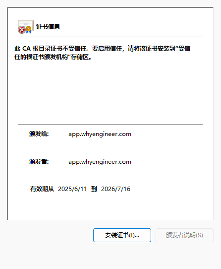

### 3. 生成客户端证书

```bash
# Generate client private key
openssl genrsa -out client.key 4096

# Generate public keys
openssl rsa -in client.key -pubout > client_pub.key
openssl rsa -in ca.key -pubout > ca_pub.key

# Create certificate signing request
openssl req -new -key client.key -out client.csr -config req.cnf

# Sign the client certificate with CA
openssl x509 -req -in client.csr -CA ca.crt -CAkey ca.key -out client.crt -CAcreateserial
```

## 返回值代码

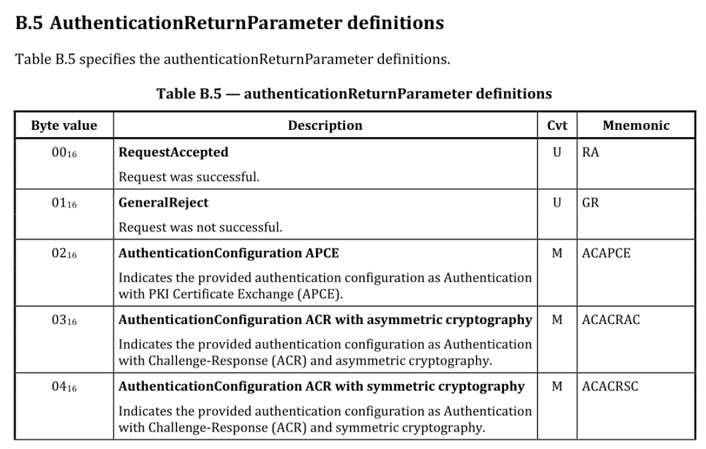

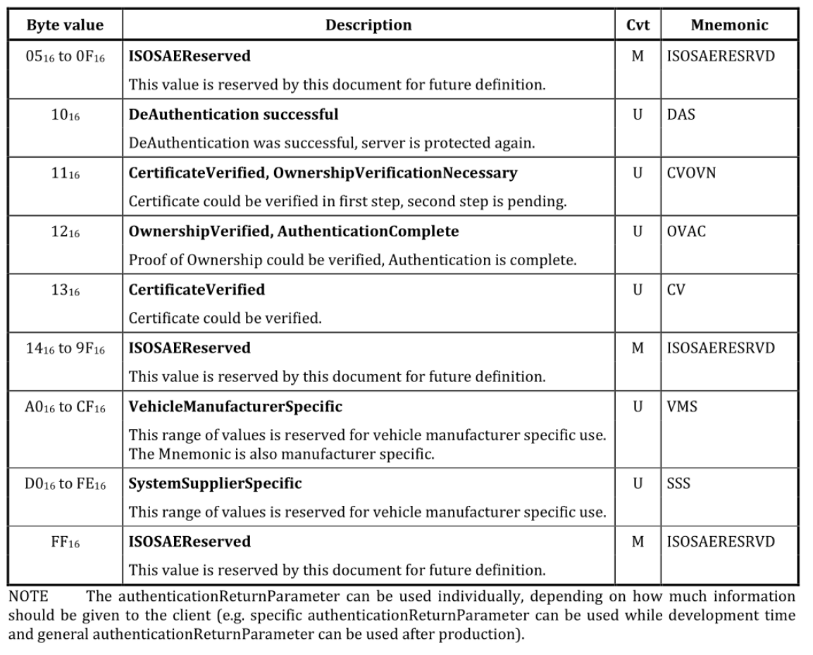

## 密钥交换算法 (ECDH/DH)

ECDH（椭圆曲线迪菲-赫尔曼）使双方能够在非安全通道上建立共享密钥。 该算法基于以下特性工作：
**(a × G) × b = (b × G) × a**

其中：

- `a` 和 `b` 是私钥
- `G` 是生成点
- `×` 表示椭圆曲线点乘

**ECDH 过程：**

1. Alice 生成：<span v-pre>`{alicePrivKey, alicePubKey = alicePrivKey × G}`</span>
2. Bob 生成：<span v-pre>`{bobPrivKey, bobPubKey = bobPrivKey × G}`</span>
3. 他们通过非安全通道交换公钥
4. Alice 计算：sharedKey = bobPubKey × alicePrivKey
5. Bob 计算：sharedKey = alicePubKey × bobPrivKey
6. 双方现在拥有相同的共享密钥

## 认证序列

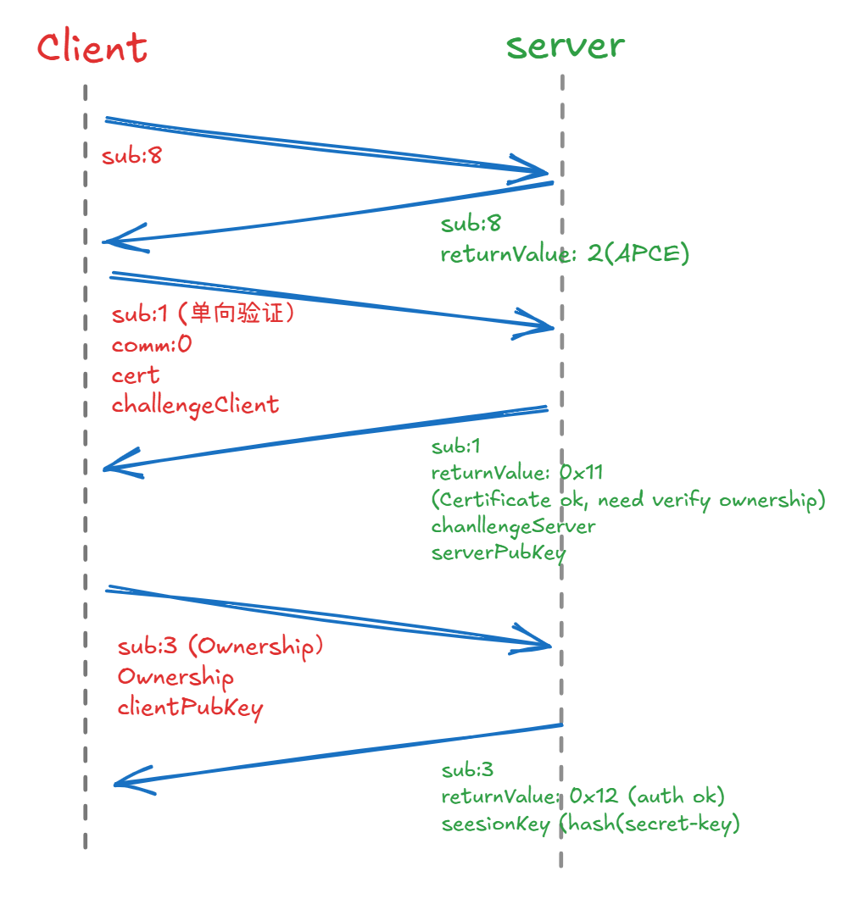

## EcuBus-Pro 实现

### 1. 配置认证序列

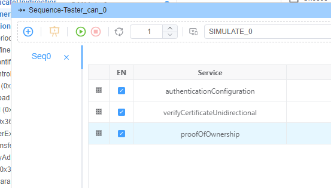

### 2. 配置测试器脚本

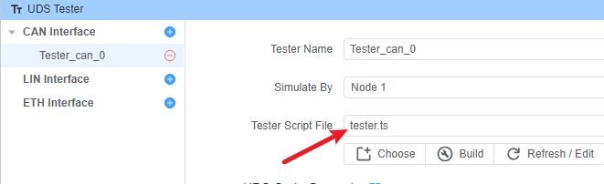

**tester.ts：**

```typescript
import { DiagRequest } from "ECB"
import fs from 'fs/promises'
import path from "path"

const challenge = Buffer.from(Array(32).fill(0).map(() => Math.floor(Math.random() * 256)))

Util.Init(async ()=>{
  // Read client certificate
  const cert = await fs.readFile(path.join(process.env.PROJECT_ROOT,'client.crt'),'utf-8')
  
  // Configure verifyCertificateUnidirectional request
  const verifyCertificateUnidirectional = DiagRequest.from("Tester_can_0.verifyCertificateUnidirectional")
  
  // Set certificate parameters
  verifyCertificateUnidirectional.diagSetParameterSize('certificateClient',cert.length*8)
  verifyCertificateUnidirectional.diagSetParameter('certificateClient',cert)
  verifyCertificateUnidirectional.diagSetParameter('lengthOfCertificateClient',cert.length)
  
  // Set challenge parameters
  verifyCertificateUnidirectional.diagSetParameter('lengthOfChallengeClient',32)
  verifyCertificateUnidirectional.diagSetParameterSize('challengeClient',32*8)
  verifyCertificateUnidirectional.diagSetParameterRaw('challengeClient',challenge)
  
  await verifyCertificateUnidirectional.changeService()
})
```

### 3. 配置 ECU 模拟器

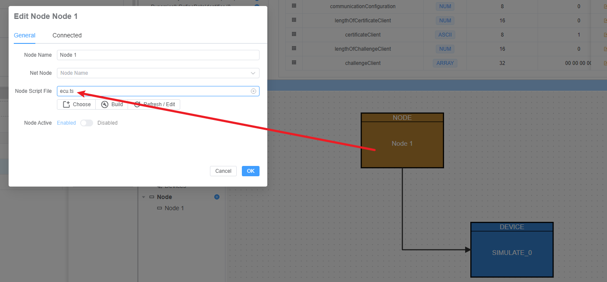

**ecu.ts：**

```typescript
import { DiagResponse } from "ECB"

Util.On("Tester_can_0.authenticationConfiguration.send",async (req)=>{
    const resp=DiagResponse.fromDiagRequest(req)
    resp.diagSetParameterSize('returnValue',0x2) // APCE mode
    await resp.outputDiag()
})
```

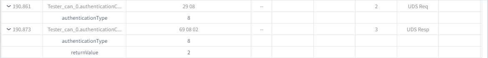

### 4. 证书验证过程

```typescript
Util.On("Tester_can_0.verifyCertificateUnidirectional.send",async (req)=>{
    const resp=DiagResponse.fromDiagRequest(req)
    
    const data=req.diagGetRaw()
    const lengthOfCertificateClient=data.readUint16BE(3)
    console.log(`Certificate length: ${lengthOfCertificateClient}`)
    
    // Parse and verify certificate
    const cert=new crypto.X509Certificate(data.subarray(5,5+lengthOfCertificateClient))
    console.log(`Certificate issuer: ${cert.issuer}`)
    
    const ca_str= await fs.readFile(path.join(process.env.PROJECT_ROOT,'ca.crt'),'utf-8')
    const ca=new crypto.X509Certificate(ca_str)
    const verifyResult=cert.verify(ca.publicKey)
    console.log(`Verification result: ${verifyResult}`)
    
    if(verifyResult){
        resp.diagSetParameter('lengthOfChallengeServer',32)
        resp.diagSetParameterSize('challengeServer',32*8)
        resp.diagSetParameterRaw('challengeServer',challenge)
        resp.diagSetParameter('returnValue',0x11) // Certificate OK, verify ownership
        await resp.outputDiag()
    } else {
        throw new Error('Client certificate verification failed')
    }
})
```

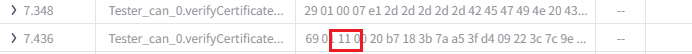

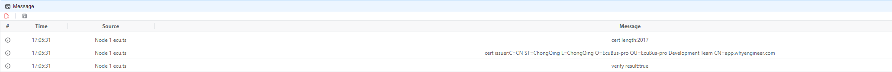

### 5. 数字签名过程

```typescript
Util.On("Tester_can_0.verifyCertificateUnidirectional.recv",async (resp)=>{
    const data=resp.diagGetRaw()
    const lengthOfChallengeServer=data.readUint16BE(3)
    const challenge=data.subarray(5,5+lengthOfChallengeServer)
    console.log(`Challenge: ${challenge.toString('hex')}`)
    
    // Sign challenge with client private key
    const privateKey=await fs.readFile(path.join(process.env.PROJECT_ROOT,'client.key'),'utf-8')
    const sign=crypto.sign('RSA-SHA256',challenge,privateKey)
    console.log(`Signature: ${sign.toString('hex')}`)
    
    // Configure proof of ownership request
    const proofOfOwnership = DiagRequest.from("Tester_can_0.proofOfOwnership")
    proofOfOwnership.diagSetParameterSize('proofOfOwnershipClient',sign.length*8)
    proofOfOwnership.diagSetParameterRaw('proofOfOwnershipClient',sign)
    proofOfOwnership.diagSetParameter('lengthOfProofOfOwnershipClient',sign.length)
    
    await proofOfOwnership.changeService()
})
```

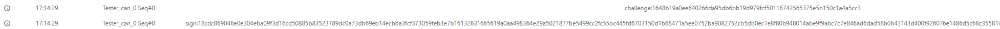

### 6. 所有权验证

首先，从证书中提取公钥：

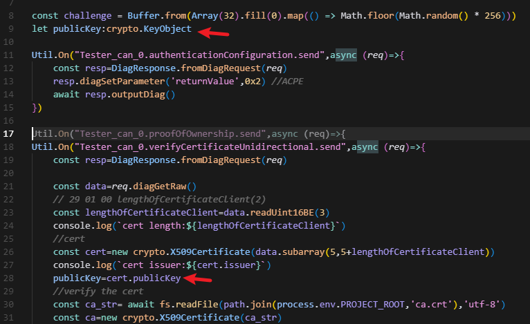

然后验证签名：

```typescript
Util.On("Tester_can_0.proofOfOwnership.send",async (req)=>{
    const resp=DiagResponse.fromDiagRequest(req)
    const data=req.diagGetRaw()
    
    const lengthOfProofOfOwnershipClient=data.readUint16BE(2)
    const sign=data.subarray(4,4+lengthOfProofOfOwnershipClient)
    
    // Verify signature using certificate's public key
    const verifyResult=crypto.verify('RSA-SHA256',challenge,publicKey,sign)
    console.log(`Verification result: ${verifyResult}`)
    
    if(verifyResult){
        resp.diagSetParameter('returnValue',0x12) // Authentication successful
        await resp.outputDiag()
    } else {
        throw new Error('Client signature verification failed')
    }
})
```

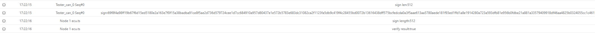
