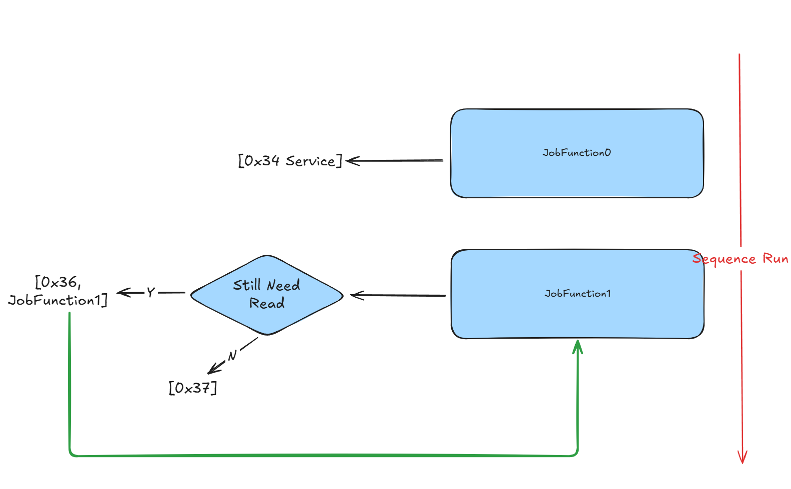

# UDS DoIP 大文件传输

本示例演示如何使用 UDS（统一诊断服务）通过 DoIP 进行**流式文件读取**，将大型二进制文件传输到 ECU。 该方法针对处理非常大的文件进行了优化，无需一次性将整个文件加载到内存中。

## 概述

该示例使用以下 UDS 服务实现大文件传输序列：

- **RequestDownload (0x34)** - 启动下载过程
- **TransferData (0x36)** - 按顺序传输数据块
- **RequestTransferExit (0x37)** - 完成传输过程

## 关键创新：流式与传统方法对比

### 传统方法（先前示例）

```typescript
// OLD: Loads entire file into memory at once
const hexStr = await fsP.readFile(hexFile, 'utf8')
const map = HexMemoryMap.fromHex(hexStr)
for (const [addr, data] of map) {
  pendingBlocks.push({ addr, data }) // All data loaded into memory
}
```

**局限性**：

- ❌ 大文件内存消耗高
- ❌ 多 GB 文件存在内存不足错误风险
- ❌ 大文件启动时间较慢
- ❌ 无法处理大于可用 RAM 的文件

### 流式方法（本示例）

```typescript
// NEW: Opens file handle for streaming reads
fHandle = await fsP.open(hexFile, 'r')

// Read only what's needed for current transfer
const data = Buffer.alloc(maxChunkSize)
const { bytesRead } = await fHandle.read(data)
```

**优势**：

- ✅ **内存高效**：一次仅加载小块数据
- ✅ **可扩展**：可处理任意大小文件（GB+）
- ✅ **快速启动**：立即开始传输
- ✅ **实时处理**：按需读取数据
- ✅ **资源使用低**：内存占用最小

## 架构与流程



传输过程遵循以下序列：

1. **JobFunction0**：启动下载请求并接收 ECU 能力
2. **"仍需读取"决策**：确定是否需要传输更多数据
3. **JobFunction1**：使用流式读取执行分块数据传输
4. **顺序处理**：持续直到整个文件传输完成

## 实现细节

### 文件流设置

```typescript
let fHandle: fsP.FileHandle | undefined

Util.Init(async () => {
  const hexFile = path.join(process.env.PROJECT_ROOT, 'large.bin')
  fHandle = await fsP.open(hexFile, 'r')  // Open for streaming
})

Util.End(async () => {
  if (fHandle) {
    await fHandle.close()  // Proper cleanup
  }
})
```

### JobFunction0 - 下载初始化

准备 ECU 接收数据并协商传输参数：

```typescript
Util.Register('Tester.JobFunction0', async () => {
  if (fHandle) {
    const fileState = await fHandle.stat()
    console.log('File size:', fileState.size)
    
    const r34 = DiagRequest.from('Tester.RequestDownload520')
    const memoryAddress = Buffer.alloc(4)
    memoryAddress.writeUInt32BE(0)
    r34.diagSetParameterRaw('memoryAddress', memoryAddress)
    r34.diagSetParameter('memorySize', fileState.size)
    
    r34.On('recv', (resp) => {
      // Get max chunk size from ECU response
      maxChunkSize = resp.diagGetParameterRaw('maxNumberOfBlockLength').readUint32BE(0)
      maxChunkSize -= 2  // Account for sequence counter
      
      // Align to 8-byte boundary for optimal transfer
      if (maxChunkSize & 0x07) {
        maxChunkSize -= maxChunkSize & 0x07
      }
    })
    return [r34]
  }
  return []
})
```

### JobFunction1 - 流式数据传输

使用流式读取执行实际文件传输：

```typescript
Util.Register('Tester.JobFunction1', async () => {
  if (fHandle) {
    const list = []
    const data = Buffer.alloc(maxChunkSize)  // Reusable buffer
    
    // Transfer multiple chunks per batch (combine36 = 6)
    for (let i = 0; i < combine36; i++) {
      const { bytesRead } = await fHandle.read(data)  // Stream read
      
      const transferRequest = DiagRequest.from('Tester.TransferData540')
      transferRequest.diagSetParameterSize('transferRequestParameterRecord', bytesRead * 8)
      transferRequest.diagSetParameterRaw(
        'transferRequestParameterRecord',
        data.subarray(0, bytesRead)  // Only send actual data
      )
      
      // Block sequence counter (1-255 rolling)
      const blockSequenceCounter = Buffer.alloc(1)
      blockSequenceCounter.writeUInt8(cnt & 0xff)
      transferRequest.diagSetParameterRaw('blockSequenceCounter', blockSequenceCounter)
      cnt++
      
      list.push(transferRequest)
      
      // Check if more data available
      if (bytesRead == maxChunkSize) {
        if (i == combine36 - 1) {
          // Continue with next batch
          list.push(DiagRequest.from('Tester.JobFunction1'))
        }
      } else {
        // End of file reached
        console.log(`Read ${bytesRead} bytes, no more data to read.`)
        
        // Send transfer exit request
        const r37 = DiagRequest.from('Tester.RequestTransferExit550')
        r37.diagSetParameterSize('transferRequestParameterRecord', 0)
        list.push(r37)
        
        // Cleanup
        await fHandle.close()
        fHandle = undefined
        break
      }
    }
    return list
  }
  return []
})
```

## 内存使用对比

| 方法     | 1GB 文件                   | 4GB 文件                   | 10GB 文件                   |
| ------ | ------------------------ | ------------------------ | ------------------------- |
| **传统** | ~1GB RAM | ~4GB RAM | ~10GB RAM |
| **流式** | ~4KB RAM | ~4KB RAM | ~4KB RAM  |

## 使用场景

这种流式方法非常适合：

- **ECU 固件更新**，涉及大型二进制文件
- **校准数据传输**，用于汽车应用
- **软件部署**到嵌入式系统
- **数据记录**和诊断信息传输
- **任何需要**内存高效大文件传输的场景

该实现相比传统方法有显著改进，能够在资源受限的环境中可靠传输非常大的文件。
