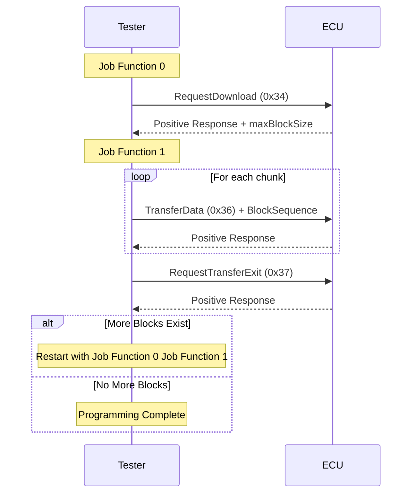

# UDS 文件编程示例

本示例演示如何使用 UDS（统一诊断服务）协议将十六进制和 S-record 文件编程到 ECU 中。 该项目展示了如何使用 `HexMemoryMap` 和 `S19MemoryMap` 解析 Intel HEX 和 Motorola S-record 文件，并使用块传输将它们编程到 ECU 中。 该项目展示了如何使用 `HexMemoryMap` 和 `S19MemoryMap` 解析 Intel HEX 和 Motorola S-record 文件，并使用块传输将它们编程到 ECU 中。

## 概述

该示例使用以下 UDS 服务实现编程序列：

- RequestDownload (0x34)
- TransferData (0x36)
- RequestTransferExit (0x37)

## 测试仪配置

### 测试仪 (tester.ts)


### 服务

- 0x34
- 0x36
- 0x37


### 序列


## `tester.ts` 实现细节

### 文件格式支持

该项目使用 `HexMemoryMap` 和 `S19MemoryMap` 支持 Intel HEX 和 Motorola S-record 格式：

#### Intel HEX 文件 (.hex)

```typescript
const hexFile = path.join(process.env.PROJECT_ROOT, 'Hello_World.hex')
const hexStr = await fsP.readFile(hexFile, 'utf8')
const map = HexMemoryMap.fromHex(hexStr)
// Convert hex data into memory blocks
for (const [addr, data] of map) {
  pendingBlocks.push({ addr, data })
}
```

#### Motorola S-record 文件 (.s19, .srec)

```typescript
const s19File = path.join(process.env.PROJECT_ROOT, 'Hello_World.s19')
const s19Str = await fsP.readFile(s19File, 'utf8')
const map = S19MemoryMap.fromS19(s19Str)
// Convert S-record data into memory blocks
for (const [addr, data] of map) {
  pendingBlocks.push({ addr, data })
}
```

#### 自动检测示例

```typescript
const filePath = process.env.FIRMWARE_FILE // Could be .hex or .s19
const fileContent = await fsP.readFile(filePath, 'utf8')
const fileExt = path.extname(filePath).toLowerCase()

let map
if (fileExt === '.hex') {
  map = HexMemoryMap.fromHex(fileContent)
} else if (fileExt === '.s19' || fileExt === '.srec') {
  map = S19MemoryMap.fromS19(fileContent)
} else {
  throw new Error(`Unsupported file format: ${fileExt}`)
}

// Both formats use the same interface
for (const [addr, data] of map) {
  pendingBlocks.push({ addr, data })
}
```

#### 支持的文件格式

| 格式                | 文件扩展名                           | 记录类型                                    | 地址范围                                                                                     |
| ----------------- | ------------------------------- | --------------------------------------- | ---------------------------------------------------------------------------------------- |
| Intel HEX         | `.hex`                          | :00-:05 | 16 位带扩展                                                                                  |
| Motorola S-record | `.s19`, `.srec`, `.s28`, `.s37` | S0-S9                                   | 16 位 (S1), 24 位 (S2), 32 位 (S3) |

`HexMemoryMap` 和 `S19MemoryMap` 都提供相同的接口，使得在格式之间切换或在同一应用程序中支持两种格式变得容易。

更多详细信息可在 API 文档中找到：

- [HexMemoryMap](https://app.whyengineer.com/scriptApi/scriptApi/classes/HexMemoryMap.html)
- [S19MemoryMap](https://app.whyengineer.com/scriptApi/scriptApi/classes/S19MemoryMap.html)

### 编程流程

编程过程分为两个主要作业功能：

#### 作业功能 0（初始请求）

- 读取下一个要编程的内存块
- 发送 RequestDownload (0x34) 服务，包含内存地址和大小
- 从 ECU 响应中获取最大块大小

```typescript
const r34 = DiagRequest.from('Tester.RequestDownload520')
const memoryAddress = Buffer.alloc(4)
memoryAddress.writeUInt32BE(currentBlock.addr)
r34.diagSetParameterRaw('memoryAddress', memoryAddress)
r34.diagSetParameter('memorySize', currentBlock.data.length)
```

#### 作业功能 1（数据传输）

- 根据 maxChunkSize 将数据分割成块
- 为每个块发送 TransferData (0x36)
- 在所有块之后发送 RequestTransferExit (0x37)
- 如果存在更多块，则重新启动过程

### 关键特性

1. **多格式支持**

   - Intel HEX 格式支持（:00-:05 记录）
   - Motorola S-record 格式支持（S0-S9 记录，含 S1/S2/S3 数据）
   - 两种格式的统一接口
   - 基于文件扩展名的自动格式检测

2. **动态块大小调整**

   - 根据 ECU 能力调整块大小
   - 对齐到 8 字节边界以优化传输

   ```typescript
   maxChunkSize -= 2 // Account for block sequence counter
   if (maxChunkSize & 0x07) {
     maxChunkSize -= maxChunkSize & 0x07
   }
   ```

3. **块序列计数器**

   - 实现 1-255 滚动计数器用于块跟踪

   ```typescript
   const blockSequenceCounter = Buffer.alloc(1)
   blockSequenceCounter.writeUInt8((i + 1) & 0xff)
   ```

4. **自动块管理**
   - 队列多个内存块
   - 自动处理块之间的转换
   - 为每个块重新启动编程序列
   - 与 HEX 和 S-record 格式无缝协作

## 流程图



## ECU 模拟

`Node 1(ecu.ts)` 模拟，响应编程请求。 ECU端处理三个主要服务：
 ECU端处理三个主要服务：


### 1. 请求下载(0x34)响应

```typescript
Util.On('Tester.RequestDownload520.send', async (req) => {
  const resp = DiagResponse.fromDiagRequest(req)
  // Response: 0x74 (positive response)
  // 0x40: length format identifier
  // 0x00000081: maxNumberOfBlockLength (129 bytes)
  resp.diagSetRaw(Buffer.from([0x74, 0x40, 0, 0, 0, 0x81]))
  await resp.outputDiag()
})
```

- 以肯定响应(0x74)进行响应
- 指定最大块长度(129字节)
- 使用长度格式标识符0x40

### 2. 传输数据(0x36)响应

```typescript
Util.On('Tester.TransferData540.send', async (req) => {
  const resp = DiagResponse.fromDiagRequest(req)
  // Response: 0x76 (positive response) + block sequence counter
  resp.diagSetRaw(Buffer.from([0x76, Number(req.diagGetParameter('blockSequenceCounter'))]))
  await resp.outputDiag()
})
```

- 以肯定响应(0x76)确认每个数据块
- 回显块序列计数器
- 模拟成功的数据传输

### 3. 请求传输退出(0x37)响应

```typescript
Util.On('Tester.RequestTransferExit550.send', async (req) => {
  const resp = DiagResponse.fromDiagRequest(req)
  // Response: 0x77 (positive response)
  resp.diagSetRaw(Buffer.from([0x77]))
  await resp.outputDiag()
})
```

- 以肯定响应(0x77)确认传输完成
- 模拟成功的编程完成

ECU仿真为编程序列提供了完整的测试环境，允许开发人员无需实际硬件即可测试其编程实现。 ECU仿真为编程序列提供了完整的测试环境，允许开发人员无需实际硬件即可测试其编程实现。 无论源文件是Intel HEX格式还是Motorola S-record格式，仿真工作方式完全相同。

## 演示


