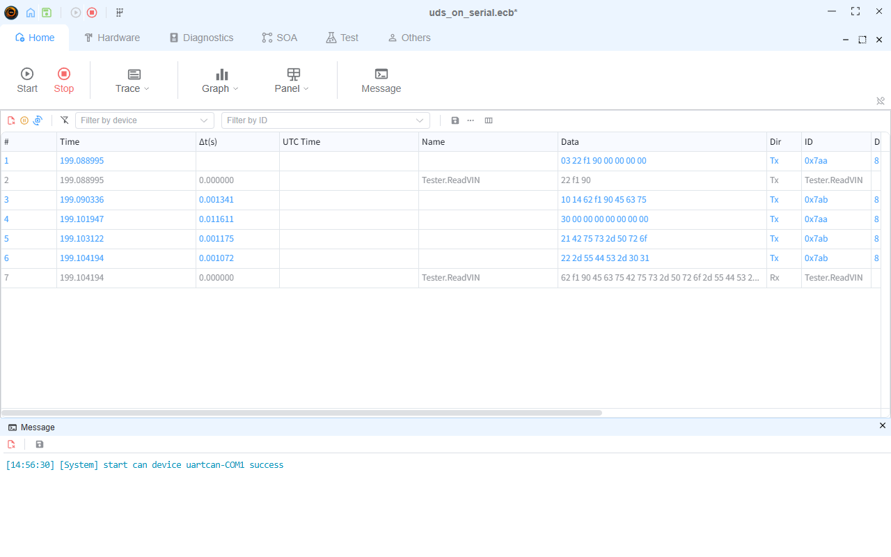

# UDS on Serial（UART-CAN）

本示例在一个普通串口上运行**完整的 UDS / ISO 15765-2 诊断交互**，ECU（从机）侧完全由脚本节点模拟——不需要任何外部硬件或 MCU 固件。

## 示例内容

| 项目 | 说明 |
|------|------|
| `UDS_Serial` 设备 | 串口上的 **UDS**（uartcan）设备。每个 CAN 帧以固定 13 字节记录传输（`ID(4字节大端) + DLC(1字节) + 数据(8字节补零)`）。 |
| `Tester` | CAN 类型 Tester，地址对 TxId `0x7AA` / RxId `0x7AB`，包含 `ReadVIN` 服务（`22 F1 90`）。 |
| `UDS_Slave` 节点（`node.ts`） | 模拟 ECU：收到 `ReadVIN` 后回复 `62 F1 90` + ASCII VIN `EcuBus-Pro-UDS-01`。 |
| `Seq0` | 包含 `ReadVIN` 服务的诊断序列。 |

由于 Tester 和模拟从机共享同一条虚拟 CAN 总线，即使串口上什么都不接，交互也能完成——同时帧也会真实地发到串口线上，随时可以换成真实 MCU。

## 运行方法

1. 打开示例，在 `UDS_Serial` 设备配置中选择一个可用的 COM 口（Hardware → Devices → Serial → UDS）。
2. **Start** 启动工程。
3. 打开 Tester 的序列视图运行 `Seq0`——同时可在 **Trace** 窗口观察交互过程。

响应共 20 字节，因此这次交互演示了串口上真实的 ISO-TP 多帧分段：单帧请求（SF）、首帧（FF）、流控（FC）和连续帧（CF）：

## 换成真实 MCU

删除（或禁用）`UDS_Slave` 节点，接入实现了 13 字节 UART 桥接的 MCU 即可——线上格式与 MCU 侧实现要点见 [UDS on Serial](https://app.whyengineer.com/docs/um/serial/uds.html) 文档。
